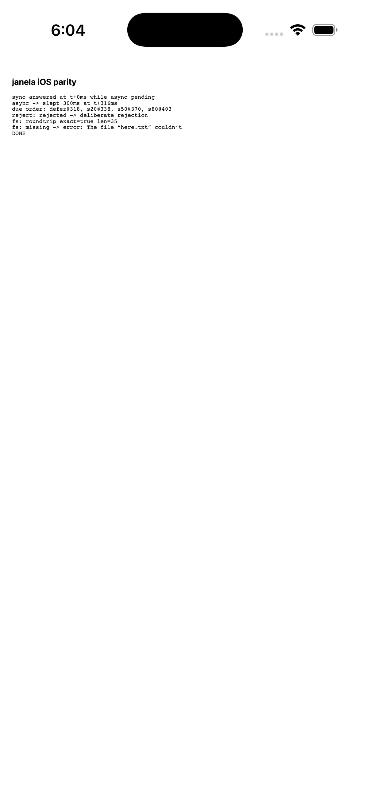
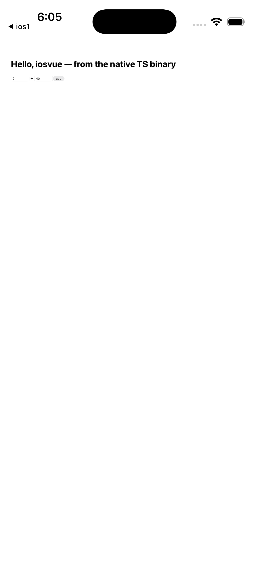

# iOS

> **Status: released since janela 0.10.0, simulator-verified.** Everything on
> this page has been run end to end in the iOS simulator. **Device builds are
> untested** — they need a signing identity and a provisioning profile, which
> janela does not set up for you — and the App Store is not covered at all.

**All five frontend templates are verified on iOS** — `vanilla`, `vue`, `react`,
`svelte` and `solid` were each built, installed and run in the simulator, with
the framework rendering host data and a typed round trip returning a `number`.
Sizes are in [frontend.md](./frontend.md).

Host `console.log` reaches the unified log under subsystem `dev.janela`,
category `host`:

```bash
xcrun simctl spawn <device> log show --last 60s --predicate 'subsystem == "dev.janela"'
```

A janela app builds and runs on iOS from the same source as its desktop
build — the same `src-host/main.ts`, the same typed contract, the same
frontend.

```bash
janela build --target ios     # -> .janela/out-ios/<name>.app  (simulator)
janela dev   --target ios     # build, boot a simulator, install, launch, follow the log
```

Requirements: macOS with Xcode, an iOS simulator runtime (Xcode → Settings →
Components), and **zig** (`brew install zig`) — scriptc routes mobile targets
through `zig cc`.

## Configure it

`janela.conf.json` gains an `ios` section; every field is optional and falls
back to the values already there.

```json
{
  "name": "my-app",
  "identifier": "dev.janela.my-app",
  "ios": {
    "identifier": "dev.janela.my-app",
    "displayName": "My App",
    "minimumVersion": "15.0"
  }
}
```

## How it differs from desktop

Desktop compiles your TypeScript to an **executable** that owns `main()` and
drives a C library over FFI. iOS turns that around: scriptc refuses to build
executables for iOS targets, so your TypeScript becomes a **static library**
and a UIKit shell owns `main()`, hosts the `WKWebView`, and calls in.

You do not write any of that. The CLI picks a lane by which runtime it
compiles your project against, so nothing in your app has to know which target
it is being built for — no `isIOS` branches, no alternate API.

A library build links **no event loop of its own** (scriptc rejects an async
module graph in library mode, `SC4005`) — but that is not a limitation you
meet, because janela never asks the compiled TypeScript to hold a timer on
either platform. It parks a continuation under an id and the shell owns the
clock: `dispatch_after` on the main queue here, a timer queue in the shim on
desktop. Same design, same behaviour.

## What works today

| | iOS |
|---|---|
| `app.command` + typed contract | yes |
| `app.emit` → `janela.listen` | yes |
| `janela.invoke` from the page | yes |
| Vite frontends (vue/react/svelte/solid) | yes |
| Plain `index.html` | yes |
| UTF-8 including emoji | yes |
| `app.commandAsync` | yes |
| `app.defer`, `app.sleep` | yes |
| `app.readFileAsync`, `app.writeFileAsync` | yes |

## Not yet on iOS

These exist and compile — your desktop code still builds for iOS — but each
one reports clearly when called instead of doing nothing.

| | why | reported as |
|---|---|---|
| `app.saveFileDialog` | mobile "save" is *export a file you already have*, which the desktop signature cannot express — see below | through the callback's error argument |
| `app.setTitle`, `app.setSize`, `app.setFullscreen` | an iOS app has no window to title or resize — this one is permanent, not unfinished | logged, then a no-op |
| `app.quit` | iOS apps are dismissed by the user, not by code — also permanent | logged, then a no-op |

Only `saveFileDialog` is pending work; the window-control entries are
meaningless on a phone and will stay no-ops.

### The file picker

`app.openFileDialog` presents `UIDocumentPickerViewController`. One thing about
the result matters:

**The path you get back is a copy inside the app's container**, under
`picked/`. iOS hands back a security-scoped URL, readable only between
`startAccessingSecurityScopedResource` and its counterpart and not readable at
all after a relaunch without a bookmark. So the shell copies the file while the
scope is held and returns that path, which `readFileAsync` already understands
and which keeps the public API identical to desktop. The copy is a snapshot;
nothing tracks the original afterwards.

`directory: true` reports `ENOTSUP` — iOS has no directory picker. Cancelling
answers `null`, exactly as on desktop.

**Filters are partial, by choice.** Restricting the picker needs uniform type
identifiers, and mapping an extension to one needs `UniformTypeIdentifiers` or
`CoreServices`, neither of which the iOS build links. A table covers the common
types (`txt`, `md`, `json`, `csv`, `html`, `pdf`, `png`, `jpeg`, `mp3`, `mp4`,
`zip` and friends); an extension outside it widens the picker to `public.item`
and says so on stderr, so a filter is never silently dropped.

**Why `saveFileDialog` is a separate question.** On desktop it means "ask the
user where to put a file, then I will write there". iOS has no such thing:
`UIDocumentPickerViewController(forExporting:)` requires the file to exist
*before* the picker opens, and Android's `ACTION_CREATE_DOCUMENT` hands back a
`content://` URI to write into rather than a path. Both platforms want an
export-shaped call — "here is a file I have made, let the user place it" —
which the desktop signature cannot express. Rather than give the same function
two different meanings per platform, it stays refused until the API question
is settled.

**Filter support will be partial.** Restricting the picker to extensions needs
UTIs, and mapping an extension to a UTI needs `UniformTypeIdentifiers` or
`CoreServices`, neither of which the iOS build links today. A table covering
common types (`txt`, `png`, `jpeg`, `pdf`, `json`, `html`, `csv`, `zip`) can be
had for free; anything outside it will widen the picker rather than fail.

### File paths on iOS

A sandboxed app has no useful working directory and cannot see host paths, so
a **relative path resolves against the app's Documents directory** — the one
place it can freely read and write:

```ts
app.writeFileAsync("notes.txt", body, (err) => { … });   // Documents/notes.txt
```

An absolute path is used as given, which on a device means somewhere inside
the app container.

Also not covered yet: real devices (needs a signing identity and a
provisioning profile) and the App Store. Android ships too — see
[android.md](android.md).

## Logging

Host `console.log` goes to **stdout and the unified log**, so you can watch an
app without attaching a debugger or screenshotting the page:

```console
$ xcrun simctl spawn booted log stream --predicate 'subsystem == "dev.janela"'
$ xcrun simctl spawn booted log show --last 2m --predicate 'subsystem == "dev.janela"'
```

Everything the host prints appears under subsystem `dev.janela`, category
`host`; `console.error` and anything on stderr is logged at error level. The
shell tees both descriptors rather than moving them, so a run attached to a
terminal prints exactly as it always did.

This matters more than it sounds. iOS has no console for stdout, so before
this the only way to see what a host command printed was to render it into the
page and take a screenshot — which is slow, lossy, and useless in CI.

## Evidence



A scaffolded app in the simulator: a sync command answering at `t+0ms` while
an async one is pending, four continuations firing in due order from
registrations made out of order, a rejected command, and a file written and
read back byte-exact including `— çãé 🚀`.



## Under the hood

- `packages/janela/runtime/ios.ts` — the iOS runtime lane. Same class name and
  public surface as the desktop runtime, so your `main.ts` compiles against
  either; a command registry and a dispatcher, with no loop machinery.
- `packages/janela/shim/ios/app.cc` — the shell, in plain C++. It owns the
  due-ordered timer queue, the table of page replies being held, file I/O on a
  serial queue, and the scriptc library's C ABI. Everything webview-shaped —
  creating the view, injecting the bootstrap, binding the invoke channel,
  evaluating JavaScript, settling a deferred reply — goes through `webview.h`.
- One library export carries every command (`handleInvoke(cmd, args) -> string`),
  so your commands need no ABI of their own; a second returns the page. Events
  travel the other way through a declared callback channel.

## The webview backend

The `WKWebView` itself is driven by a **UIKit backend for
[webview/webview](https://github.com/webview/webview)** that lives in this
repo's vendored copy, at
`packages/janela/vendor-webview/core/include/webview/detail/backends/uikit_webkit.hh`
with its platform wrappers under `detail/platform/darwin/uikit/`.

It is written in the shape upstream uses for the Cocoa backend — plain C++ over
the Objective-C runtime, deriving from `engine_base` — because upstream lists
mobile on its v1 roadmap with no implementation, and this is meant to be
offered there rather than kept private. Three parts of the C API do not fit a
phone, and the backend documents each in place:

| API | On iOS |
|---|---|
| `run()` | enters `UIApplicationMain`, which never returns |
| `terminate()` | no-op — an iOS app cannot exit itself |
| `set_size()` | no-op — the window is the screen |
| `set_title()` | sets the root view controller's title |
| `create(debug, window)` | `nullptr` builds the app, window and root view controller; a `UIView*` attaches to an embedder's view instead |

Because `UIApplicationMain` never returns, the web view is built eagerly in the
constructor and only the window is created at launch — so `navigate`,
`set_html`, `init` and `bind` all still work before `run()`.

The approach follows [wry](https://github.com/tauri-apps/wry) (Apache-2.0),
`src/wkwebview/`, which attaches its webview to a `UIView` supplied by tao;
janela has no tao, so the `nullptr` path creates the window itself.
